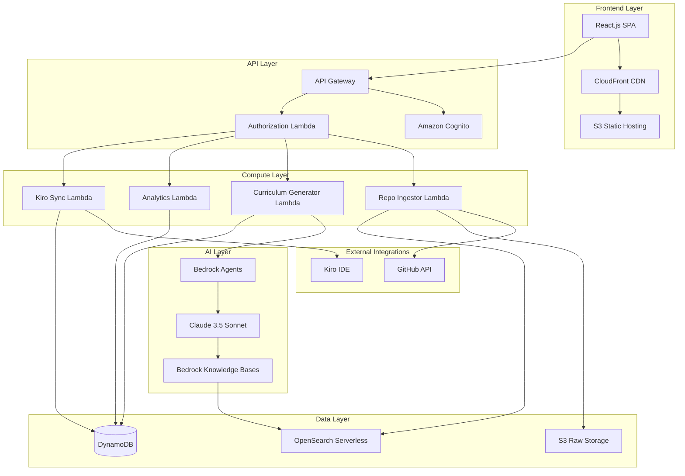
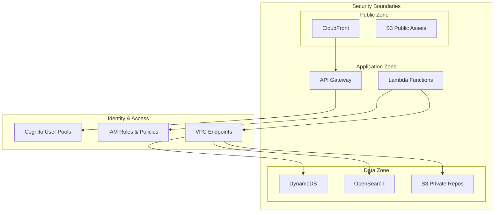
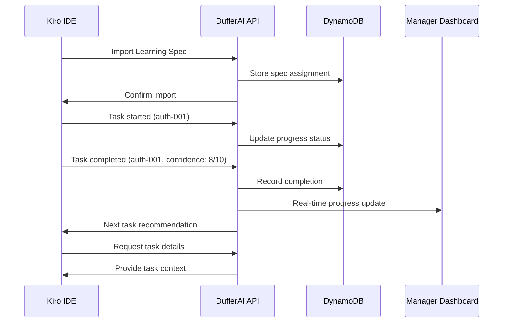

# Design Document: DufferAI Developer Onboarding Platform

## Overview

DufferAI is a serverless B2B platform built on AWS that accelerates junior developer onboarding through AI-powered codebase analysis and structured learning path generation. The system leverages Amazon Bedrock for intelligent curriculum planning and conversational tutoring, while integrating seamlessly with Kiro IDE for task execution and progress tracking.

The platform addresses the critical business problem where junior developers require 4-8 weeks to understand complex codebases, consuming significant senior developer time. By automating curriculum generation and providing AI-powered guidance, DufferAI reduces onboarding time and improves developer productivity. This is particularly impactful for fast-growing Indian startups and service-based companies with frequent junior hiring.

The initial MVP focuses on core onboarding flows for a single repository and a limited set of domains (auth, API, data models) to ensure feasibility and rapid time-to-market.

## Architecture

### High-Level Architecture



### Security Architecture



## Components and Interfaces

### 1. Repo Ingestor Service

**Responsibilities:**
- Handle GitHub OAuth integration and repository cloning
- Process ZIP file uploads with validation
- Parse file structures and extract import relationships
- Chunk code files for vector embedding
- Trigger vector indexing pipeline

**Key Interfaces:**
```typescript
interface RepoIngestorService {
  ingestGitHubRepo(repoUrl: string, accessToken: string): Promise<IngestionResult>
  ingestZipFile(zipBuffer: Buffer, metadata: RepoMetadata): Promise<IngestionResult>
  parseCodeStructure(files: CodeFile[]): Promise<CodeStructure>
  chunkCodeForEmbedding(files: CodeFile[]): Promise<CodeChunk[]>
}

interface IngestionResult {
  repositoryId: string
  status: 'success' | 'failed' | 'partial'
  processedFiles: number
  errors: IngestionError[]
  vectorIndexId: string
}
```

**Implementation Details:**
- Uses AWS Lambda with 15-minute timeout for large repositories
- Streams large files to S3 to avoid memory limits
- Implements retry logic for transient GitHub API failures
- Validates file types against supported programming languages
- Creates hierarchical file structure representation

### 2. Vector Indexer Service

**Responsibilities:**
- Generate semantic embeddings for code chunks using Bedrock
- Store vectors in OpenSearch Serverless with metadata
- Maintain code context and relationships
- Support incremental updates for repository changes

**Key Interfaces:**
```typescript
interface VectorIndexerService {
  createEmbeddings(chunks: CodeChunk[]): Promise<EmbeddingResult[]>
  indexCodeVectors(embeddings: EmbeddingResult[], repoId: string): Promise<IndexResult>
  updateIndex(repoId: string, changedFiles: CodeFile[]): Promise<UpdateResult>
  searchSimilarCode(query: string, repoId: string): Promise<SearchResult[]>
}

interface CodeChunk {
  id: string
  content: string
  filePath: string
  startLine: number
  endLine: number
  language: string
  context: CodeContext
}
```

**Implementation Details:**
- Uses Amazon Bedrock Titan Embeddings for code vectorization
- Preserves function signatures, class definitions, and comments
- Implements sliding window chunking with overlap for context preservation
- Stores metadata including file paths, line numbers, and language types
- Supports semantic search with relevance scoring

### 3. Curriculum Agent Service

**Responsibilities:**
- Analyze repository structure to identify core domains
- Generate structured day-based or milestone-based learning sequences
- Create specific learning tasks with time estimates
- Adapt curriculum based on codebase complexity and patterns

**Key Interfaces:**
```typescript
interface CurriculumAgentService {
  analyzeRepository(repoId: string): Promise<DomainAnalysis>
  generateLearningPath(analysis: DomainAnalysis, learnerProfile: LearnerProfile): Promise<LearningPath>
  createLearningTasks(path: LearningPath): Promise<LearningTask[]>
  estimateTaskDuration(task: LearningTask): Promise<number>
}

interface DomainAnalysis {
  coreDomains: Domain[]
  complexity: 'beginner' | 'intermediate' | 'advanced'
  recommendedSequence: string[]
  keyFiles: string[]
  dependencies: DependencyGraph
}

interface LearningPath {
  id: string
  repositoryId: string
  totalDuration: number
  phases: LearningPhase[]
  prerequisites: string[]
}
```

**Implementation Details:**
- Leverages Bedrock Agents with custom tools for code analysis
- Uses Claude 3.5 Sonnet for intelligent curriculum planning
- Implements domain-specific templates (auth, data models, APIs)
- Considers codebase size and complexity for task sizing
- Generates progressive learning sequences from foundational to advanced

### 4. AI Tutor Service

**Responsibilities:**
- Process natural language questions about codebases
- Retrieve relevant code snippets using RAG
- Generate explanations with analogies for junior developers
- Maintain conversation context and history

**Key Interfaces:**
```typescript
interface AITutorService {
  askQuestion(question: string, repoId: string, conversationId: string): Promise<TutorResponse>
  searchCodebase(query: string, repoId: string): Promise<CodeSearchResult[]>
  generateExplanation(code: string, context: string): Promise<Explanation>
  maintainConversation(conversationId: string): Promise<ConversationHistory>
}

interface TutorResponse {
  answer: string
  codeSnippets: CodeSnippet[]
  filePaths: string[]
  analogies: string[]
  followUpQuestions: string[]
  confidence: number
}
```

**Implementation Details:**
- Uses Bedrock Knowledge Bases for RAG over code vectors
- Implements conversation memory with DynamoDB storage
- Generates beginner-friendly explanations with technical accuracy
- Provides file paths and line numbers for code references
- Supports follow-up questions with maintained context

### 5. Kiro Sync Service

**Responsibilities:**
- Generate Kiro-compatible learning specifications
- Handle bidirectional communication with Kiro IDE
- Process task completion notifications
- Synchronize progress data in real-time

**Key Interfaces:**
```typescript
interface KiroSyncService {
  generateKiroSpec(learningPath: LearningPath): Promise<KiroSpec>
  exportSpecification(specId: string): Promise<string>
  receiveProgressUpdate(update: ProgressUpdate): Promise<void>
  syncTaskCompletion(taskId: string, completion: TaskCompletion): Promise<void>
}

interface KiroSpec {
  version: string
  metadata: SpecMetadata
  tasks: KiroTask[]
  dependencies: TaskDependency[]
}

interface ProgressUpdate {
  learnerId: string
  taskId: string
  status: 'started' | 'completed' | 'blocked'
  confidence: number
  timeSpent: number
  notes?: string
}
```

**Implementation Details:**
- Formats learning tasks according to Kiro IDE specification
- Implements webhook endpoints for real-time progress updates
- Maintains task dependency graphs for proper sequencing
- Supports task metadata including estimated duration and difficulty
- Handles offline synchronization when Kiro reconnects

### 6. Analytics Service

**Responsibilities:**
- Track learner progress and completion rates
- Calculate time-to-productivity metrics
- Generate manager dashboard data
- Identify learners needing additional support

**Key Interfaces:**
```typescript
interface AnalyticsService {
  trackProgress(learnerId: string, progress: ProgressData): Promise<void>
  calculateMetrics(organizationId: string): Promise<OrganizationMetrics>
  generateDashboardData(managerId: string): Promise<DashboardData>
  identifyAtRiskLearners(organizationId: string): Promise<AtRiskLearner[]>
}

interface OrganizationMetrics {
  averageOnboardingTime: number
  completionRates: CompletionRate[]
  productivityTrends: ProductivityTrend[]
  domainDifficulty: DomainDifficulty[]
}
```

**Implementation Details:**
- Uses DynamoDB streams for real-time analytics processing
- Implements time-series data storage for trend analysis
- Calculates rolling averages and percentile metrics
- Generates alerts for learners falling behind expected progress
- Supports comparative analysis across different codebases

## Data Models

### User Management

```typescript
interface User {
  userId: string
  email: string
  role: 'manager' | 'learner'
  organizationId: string
  profile: UserProfile
  createdAt: Date
  lastActive: Date
}

interface UserProfile {
  name: string
  experienceLevel: 'junior' | 'mid' | 'senior'
  preferredLanguages: string[]
  learningStyle: 'visual' | 'hands-on' | 'theoretical'
  timezone: string
}
```

### Repository Management

```typescript
interface Repository {
  repositoryId: string
  organizationId: string
  name: string
  source: 'github' | 'zip'
  sourceUrl?: string
  language: string
  size: number
  complexity: 'low' | 'medium' | 'high'
  vectorIndexId: string
  structure: CodeStructure
  createdAt: Date
  lastUpdated: Date
}

interface CodeStructure {
  directories: Directory[]
  files: FileMetadata[]
  dependencies: Dependency[]
  entryPoints: string[]
  testFiles: string[]
}
```

### Learning Path Management

```typescript
interface LearningPath {
  pathId: string
  repositoryId: string
  learnerId: string
  title: string
  description: string
  estimatedDuration: number
  difficulty: 'beginner' | 'intermediate' | 'advanced'
  phases: LearningPhase[]
  status: 'draft' | 'active' | 'completed'
  createdAt: Date
  updatedAt: Date
}

interface LearningPhase {
  phaseId: string
  title: string
  description: string
  dayRange: [number, number]
  tasks: LearningTask[]
  prerequisites: string[]
}

interface LearningTask {
  taskId: string
  title: string
  description: string
  type: 'read' | 'analyze' | 'implement' | 'test'
  filePaths: string[]
  estimatedMinutes: number
  difficulty: number
  learningObjectives: string[]
  completionCriteria: string[]
}
```

### Progress Tracking

```typescript
interface ProgressLog {
  logId: string
  learnerId: string
  taskId: string
  pathId: string
  status: 'not_started' | 'in_progress' | 'completed' | 'blocked'
  startedAt?: Date
  completedAt?: Date
  timeSpent: number
  confidence: number
  notes?: string
  blockers?: string[]
}

interface LearnerMetrics {
  learnerId: string
  pathId: string
  overallProgress: number
  completedTasks: number
  totalTasks: number
  averageConfidence: number
  totalTimeSpent: number
  currentStreak: number
  lastActivity: Date
  riskScore: number
}
```

## Kiro Integration Flow

### Learning Spec Generation

The system generates Kiro-compatible specifications following this process:

1. **Spec Creation**: Convert LearningPath to KiroSpec format
2. **Task Mapping**: Transform LearningTasks to Kiro task format
3. **Dependency Resolution**: Establish task prerequisites and sequencing
4. **Metadata Enrichment**: Add file references, time estimates, and learning objectives

```yaml
# Example Kiro Spec Output
apiVersion: kiro.dev/v1
kind: LearningSpec
metadata:
  name: "auth-module-onboarding"
  repository: "company/backend-api"
  estimatedDuration: "5 days"
  
spec:
  phases:
    - name: "Foundation"
      days: 1-2
      tasks:
        - id: "auth-001"
          title: "Read Authentication Overview"
          type: "read"
          files: ["src/auth/README.md", "src/auth/types.ts"]
          estimatedMinutes: 30
          objectives:
            - "Understand authentication flow"
            - "Identify key components"
          
    - name: "Implementation Deep Dive"
      days: 3-5
      tasks:
        - id: "auth-002"
          title: "Analyze JWT Token Handler"
          type: "analyze"
          files: ["src/auth/jwt.ts", "src/auth/middleware.ts"]
          estimatedMinutes: 45
          prerequisites: ["auth-001"]
```

### Bidirectional Communication



### Progress Synchronization

The system maintains real-time synchronization through:

1. **Webhook Endpoints**: Kiro sends progress updates via HTTP webhooks
2. **Event Streaming**: DynamoDB streams trigger real-time dashboard updates
3. **Conflict Resolution**: Handle offline/online synchronization conflicts
4. **Retry Logic**: Ensure reliable delivery of progress updates

## Design Goals

### Security

**Repository Isolation:**
- Each organization's repositories are isolated using IAM policies
- S3 bucket policies prevent cross-organization access
- OpenSearch indexes are partitioned by organization
- VPC endpoints ensure private communication between services

**Data Protection:**
- All data encrypted at rest using AWS KMS
- TLS 1.3 for data in transit
- Cognito handles authentication with MFA support
- Fine-grained IAM roles for service-to-service communication

**Access Control:**
```typescript
interface SecurityPolicy {
  organizationId: string
  allowedRepositories: string[]
  userPermissions: {
    [userId: string]: Permission[]
  }
  dataRetentionDays: number
  encryptionKeyId: string
}
```

### Scalability

**Horizontal Scaling:**
- Lambda functions auto-scale based on demand
- OpenSearch Serverless handles variable query loads
- DynamoDB on-demand scaling for unpredictable traffic
- CloudFront CDN for global content delivery

**Performance Optimization:**
- Code chunking strategies for large repositories
- Caching layers for frequently accessed data
- Asynchronous processing for non-critical operations
- Connection pooling for database operations

**Resource Management:**
```typescript
interface ScalingConfiguration {
  lambdaConcurrency: {
    reserved: number
    provisioned: number
  }
  dynamodbCapacity: {
    readUnits: 'on-demand' | number
    writeUnits: 'on-demand' | number
  }
  opensearchNodes: {
    instanceType: string
    instanceCount: number
  }
}
```

### Performance

**Fast RAG Search:**
- Optimized vector embeddings with 1536 dimensions
- Semantic search with sub-second response times
- Intelligent caching of frequent queries
- Pre-computed embeddings for common code patterns

**Response Time Targets:**
- API Gateway responses: < 200ms (95th percentile)
- Vector search queries: < 500ms (95th percentile)
- Learning path generation: < 30 seconds
- Real-time progress updates: < 100ms

**Monitoring and Alerting:**
```typescript
interface PerformanceMetrics {
  apiLatency: {
    p50: number
    p95: number
    p99: number
  }
  searchLatency: {
    vectorSearch: number
    codeRetrieval: number
  }
  systemHealth: {
    errorRate: number
    availability: number
    throughput: number
  }
}
```

## Error Handling

The system implements comprehensive error handling across all components:

1. **Graceful Degradation**: Non-critical features continue working during partial failures
2. **Retry Logic**: Exponential backoff for transient failures
3. **Circuit Breakers**: Prevent cascade failures in distributed system
4. **Error Monitoring**: CloudWatch alarms and SNS notifications for critical issues
5. **User-Friendly Messages**: Clear error communication without exposing system internals

## Testing Strategy

The system will be validated through a dual testing approach combining unit tests for specific functionality and property-based tests for universal correctness properties. This comprehensive strategy ensures both concrete behavior validation and broad input coverage through randomized testing.

**Unit Testing Focus:**
- API endpoint validation with specific request/response examples
- Authentication and authorization edge cases
- Error handling scenarios and boundary conditions
- Integration points between AWS services
- Kiro IDE communication protocols

**Property-Based Testing Focus:**
- Universal properties that must hold across all valid inputs
- Comprehensive input coverage through randomization
- Minimum 100 iterations per property test for statistical confidence
- Each property test references its corresponding design document property

**Testing Infrastructure:**
- Jest for unit testing with AWS SDK mocking
- Property-based testing library (fast-check for TypeScript)
- Integration tests using AWS LocalStack
- End-to-end tests with Cypress for critical user flows
- Performance testing with Artillery for load validation

## Correctness Properties

*A property is a characteristic or behavior that should hold true across all valid executions of a system—essentially, a formal statement about what the system should do. Properties serve as the bridge between human-readable specifications and machine-verifiable correctness guarantees.*

### Property 1: Repository Ingestion Completeness
*For any* valid repository (GitHub or ZIP), successful ingestion should result in parsed file structures, created vector indices, and stored repository metadata
**Validates: Requirements 1.1, 1.2, 1.3, 1.4**

### Property 2: Error Handling Consistency  
*For any* invalid or unsupported input, the system should provide clear error messages and maintain system stability
**Validates: Requirements 1.5**

### Property 3: Learning Path Generation Pipeline
*For any* successfully ingested codebase, the system should generate a complete learning path with domain analysis, day-based or milestone-based sequences, time estimates, and Kiro-compatible specs
**Validates: Requirements 2.1, 2.2, 2.4, 2.5**

### Property 4: Learning Sequence Ordering
*For any* generated learning sequence, foundational concepts should always appear before advanced implementations in the task ordering
**Validates: Requirements 2.3**

### Property 5: AI Tutor Response Completeness
*For any* code-related question, the AI tutor should search vectors, return relevant snippets, and include file paths, line numbers, and contextual explanations
**Validates: Requirements 3.1, 3.2**

### Property 6: Conversation Context Preservation
*For any* conversation session, the AI tutor should maintain question history and provide contextual responses to follow-up questions
**Validates: Requirements 3.5**

### Property 7: Learning Spec Completeness
*For any* generated learning path, the corresponding Learning_Specs should contain actionable tasks, descriptions, file references, and completion criteria formatted for Kiro IDE compatibility
**Validates: Requirements 4.1, 4.2, 4.3**

### Property 8: Bidirectional Progress Synchronization
*For any* learning spec import or task completion, the system should establish communication channels and synchronize progress data in real-time between DufferAI and Kiro IDE
**Validates: Requirements 4.4, 4.5, 9.2, 9.3, 9.5**

### Property 9: Progress Tracking Data Completeness
*For any* completed learning task, the system should record timestamps, confidence ratings, and calculate updated learner metrics
**Validates: Requirements 5.1, 5.2**

### Property 10: Analytics Dashboard Completeness
*For any* analytics request, the system should display completion percentages, confidence trends, time spent per domain, and comparative data across learners
**Validates: Requirements 5.3, 7.1, 7.2, 7.5**

### Property 11: Automated Support Identification
*For any* learner with below-threshold performance patterns, the system should flag areas requiring manager intervention and highlight at-risk status
**Validates: Requirements 5.4, 7.3**

### Property 12: Report Export Functionality
*For any* generated analytics report, the system should provide exportable formats suitable for stakeholder communication
**Validates: Requirements 5.5, 7.4**

### Property 13: Authentication and Authorization Consistency
*For any* platform access attempt, the system should authenticate via Cognito with MFA support, verify organizational permissions for managers, and restrict learner access to assigned content
**Validates: Requirements 6.1, 6.2, 6.3**

### Property 14: Session Security Management
*For any* expired session or unauthorized access attempt, the system should require re-authentication for sensitive data and log security events while denying access
**Validates: Requirements 6.4, 6.5**

### Property 15: Vector Processing Pipeline Completeness
*For any* source code file, the vector indexer should create semantic embeddings via Bedrock, preserve file structure and context, and store vectors in OpenSearch Serverless
**Validates: Requirements 8.1, 8.2, 8.3**

### Property 16: Incremental Index Updates
*For any* codebase update, the system should incrementally update the vector index without full reprocessing while maintaining search result relevance ranking
**Validates: Requirements 8.4, 8.5**

### Property 17: Kiro Integration Standards Compliance
*For any* Learning_Spec export, the format should conform to Kiro IDE specification standards and enable contextual help delivery within the Kiro environment
**Validates: Requirements 9.1, 9.4**

### Property 18: Auto-scaling and Performance Optimization
*For any* increased system load, Lambda functions should auto-scale, large codebases should use streaming/chunking, and the frontend should be served via CloudFront CDN
**Validates: Requirements 10.1, 10.2, 10.4**

### Property 19: Data Storage and Partitioning Strategy
*For any* user data storage operation, the system should use DynamoDB with appropriate partitioning for high availability
**Validates: Requirements 10.3**

### Property 20: Error Recovery and Graceful Degradation
*For any* system error, the system should implement retry logic and graceful degradation for non-critical features while maintaining core functionality
**Validates: Requirements 10.5**